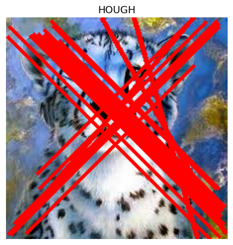

# Edge-Linking-using-Hough-Transformm
## Aim:
To write a Python program to detect the lines using Hough Transform.

## Software Required:
Anaconda - Python 3.7

## Algorithm:
### Step1:

Import all the necessary modules for the program.
### Step2:

Load a image using imread() from cv2 module.
### Step3:

Convert the image to grayscale.
### Step4:

Using Canny operator from cv2,detect the edges of the image.
### Step5:

Using the HoughLinesP(),detect line co-ordinates for every points in the images.Using For loop,draw the lines on the found co-ordinates.Display the image.

## Program:
```py
# Read image and convert it to grayscale image

import cv2
import numpy as np
import matplotlib.pyplot as plt
image=cv2.imread("color.jpeg")
gray=cv2.cvtColor(image,cv2.COLOR_BGR2GRAY)
plt.imshow(img)

## Find the edges in the image using canny detector and display
edge=cv2.Canny(gray,120,150)
plt.imshow(edge) 
plt.title('EDGES') 
plt.axis('off')

## Detect points that form a line using HoughLinesP
lines=cv2.HoughLinesP(edge,1,np.pi/180, threshold=80, minLineLength=50,maxLineGap=250)

## Draw lines on the image
for line in lines:
    x1,y1,x2,y2=line[0]
    cv2.line(image, (x1,y1), (x2,y2), (255,0,0), 3)
plt.imshow(image)
plt.title('HOUGH')
plt.axis('off')

```
## Output

### Input image and grayscale image


### Canny Edge detector output


### Display the result of Hough transform


## Result:
Thus the program is executed successfully!
